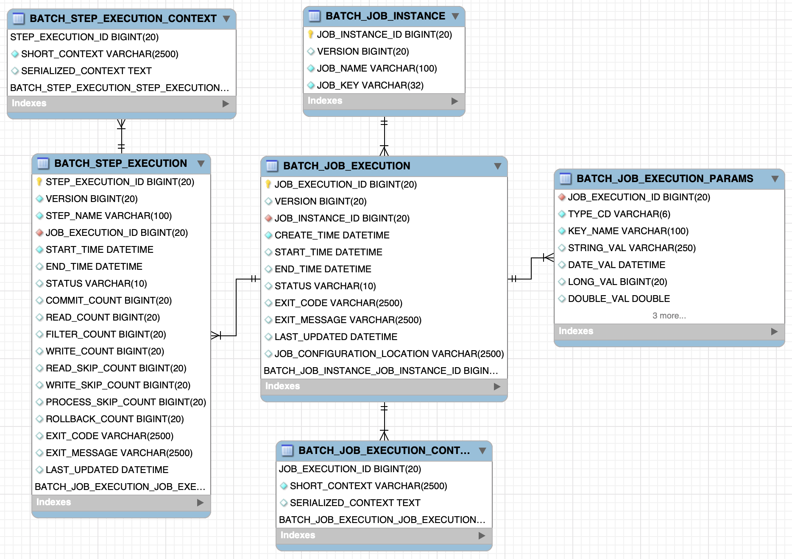

# Spring-Boot-Batch-Example

### 1. 배치 어플리케이션이란 ?

> 배치(Batch) - **일괄처리** 라는 뜻

매일 전날의 데이터를 집계해야 하는 상황을 가정  
해당 기능은 **하루에 1번 수행** > 이러한 기능을 위하여 API를 구성한다면 
 

1. 방대한 양의 데이터를 읽고 가공한다면 해당 서버는 순식간에 CPU, I/O 등의 자원을 다 소비하여 Request를 받지 못하는 현상이 발생

2. 5만번째에서 실패했다면 처음부터 다시 시작
3. 누군가 이미 집계함수를 실행하여 집계함수를 2번 실행

바로 이런 단발성으로 대용량의 데이터를 처리하는 어플리케이션 = **배치 어플리케이션**  
 
#### 배치 어플리케이션의 조건
 - 대용량 데이터 - 배치 어플리케이션은 대량의 데이터를 가져오거나, 전달하거나, 계산하는 등의 처리를 할 수 ​​있어야 합니다.
 - 자동화 - 배치 어플리케이션은 심각한 문제 해결을 제외하고는 사용자 개입 없이 실행되어야 합니다.
 - 견고성 - 배치 어플리케이션은 잘못된 데이터를 충돌/중단 없이 처리할 수 있어야 합니다.
 - 신뢰성 - 배치 어플리케이션은 무엇이 잘못되었는지를 추적할 수 있어야 합니다. (로깅, 알림)
 - 성능 - 배치 어플리케이션은 지정한 시간 안에 처리를 완료하거나 동시에 실행되는 다른 어플리케이션을 방해하지 않도록 수행되어야합니다.
 

### 2. Spring Batch ?

Spring Batch는 Accenture와 Spring Source의 공동 작업으로 2007년에 탄생
Accenture의 배치 노하우 & 기술력과 Spring 프레임워크가 합쳐져 만들어진 것이 Spring Batch  
 
DI, AOP, 서비스 추상화 등 Spring 프레임워크의 3대 요소를 모두 사용 가능  
Accenture의 Batch 노하우가 담긴 아키텍처 사용 가능  
 

### 3. Annotation 및 Method

- **@Configuration**
   - Spring Batch의 모든 Job은 @Configuration으로 등록해서 사용합니다.
- **jobBuilderFactory.get("jobName")**
   - jobName 이란 이름의 Batch Job을 생성합니다.
   - job의 이름은 별도로 지정하지 않고 Builder를 통해 지정합니다.
- **stepBuilderFactory.get("stepName")**
   - stepName 이란 이름의 Batch Step을 생성합니다.
   - jobBuilderFactory.get("stepName")와 마찬가지로 Builder를 통해 이름을 지정합니다.
- **.tasklet((contribution, chunkContext)) -> { 수행 기능; return RepeatStatus }**
   - Step 안에서 수행될 기능들을 명시합니다.
   - Tasklet은 Step안에서 단일로 수행될 커스텀한 기능들을 선언할때 사용합니다.  
 

> Spring Batch에서  
>  - **Job**은 **하나의 배치 작업 단위**  
>  - **Job 안에는** 아래처럼 **여러 Step**이 존재하고  
>  - **Step 안에** **Tasklet** 혹은 **Reader & Processor & Writer** 묶음이 존재  

 

**Tasklet** 하나와 **Reader & Processor & Writer** 한 묶음이 **같은 레벨**  
Tasklet과  Reader & Processor & Writer 를 **분리**할 수 없음  
 

### 4. Spring Batch Meta Data ?

 - 이전에 실행한 Job이 어떤 것들이 있는지  
 - 최근 실패한 Batch Parameter가 어떤것들이 있고, 성공한 Job은 어떤것들이 있는지  
 - 다시 실행한다면 어디서 부터 시작하면 될지  
 - 어떤 Job에 어떤 Step들이 있었고, Step들 중 성공한 Step과 실패한 Step들은 어떤것들이 있는지  

등등 Batch 어플리케이션을 운영하기 위한 메타데이터가 여러 테이블에 나눠져 있다.  
 

#### MySQL에서 Spring Batch 실행
##### 1. MySQL 에서 Meta Data Table 생성
 - file search - **schema-mysql.sql** 검색 후 쿼리문을 MySQL에서 실행

##### 2. Spring boot DB 연결
 - Mybatis 연결 및 properties 파일 추가

##### 3. active profile 에 mysql 추가 후 실행

### 4. Spring Batch Meta Data에 대하여...

 - ERD
  

1. BATCH_JOB_INSTANCE
